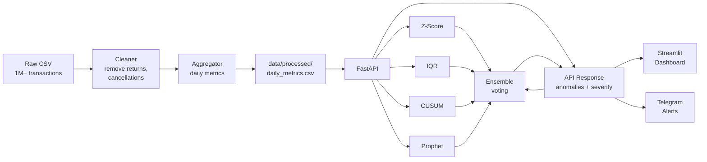

# Anomaly Detection Service

[](https://github.com/AbsoluteSuperb/anomaly-detection-servic/actions)

[](LICENSE)

Production-ready microservice for detecting anomalies in e-commerce metrics. Built with FastAPI, Prophet, scikit-learn, and Streamlit. Analyzes daily revenue, orders, average check, and customer activity to catch spikes, drops, level shifts, and unusual patterns.

**Dataset:** [Online Retail II](https://archive.ics.uci.edu/dataset/502/online+retail+ii) (UCI) — 1M+ transactions, 2009–2011, UK-based online retailer.

## Quick Start

```bash
# 1. Clone and install
git clone https://github.com/AbsoluteSuperb/anomaly-detection-servic.git
cd anomaly-detection-service
make install

# 2. Place dataset at data/raw/online_retail_II.csv, then preprocess
make preprocess

# 3. Run the API
make run
# -> http://localhost:8000/docs

# 4. (Optional) Run the dashboard
make dashboard
# -> http://localhost:8501
```

### Docker

```bash
# Copy your .env file first (or create from example)
cp .env.example .env

# Build and run both API + dashboard
make docker
# API: http://localhost:8000  |  Dashboard: http://localhost:8501
```

## API Endpoints

| Method | Path | Description |
|--------|------|-------------|
| `GET` | `/api/v1/health` | Service status, loaded data info, available detectors |
| `GET` | `/api/v1/metrics` | Summary statistics for all metrics |
| `GET` | `/api/v1/metrics/{name}` | Time series data (supports `?start_date=&end_date=`) |
| `POST` | `/api/v1/detect` | Run anomaly detection |
| `GET` | `/api/v1/anomalies` | Cached results (filters: `severity`, `metric`, `start_date`, `end_date`) |
| `GET` | `/api/v1/plot/{name}` | Interactive Plotly chart (HTML) |

### Examples

```bash
# Health check
curl http://localhost:8000/api/v1/health

# Run Z-Score detection on revenue
curl -X POST http://localhost:8000/api/v1/detect \
  -H "Content-Type: application/json" \
  -d '{"detector": "zscore", "metric_name": "revenue"}'

# Run full ensemble detection
curl -X POST http://localhost:8000/api/v1/detect \
  -H "Content-Type: application/json" \
  -d '{"detector": "ensemble"}'

# Get critical anomalies
curl "http://localhost:8000/api/v1/anomalies?severity=critical"
```

## Detection Methods

| Method | Type | Strengths | Weaknesses | Best for |
|--------|------|-----------|------------|----------|
| **Z-Score** | Statistical | Fast, interpretable | No seasonality awareness | Quick scans, point spikes |
| **IQR** | Statistical | Robust to outliers in training data | No seasonality awareness | Skewed distributions |
| **CUSUM** | Statistical | Catches sustained level shifts and trend changes | Sensitive to drift parameter | Trend monitoring, process shifts |
| **Prophet** | ML (time series) | Handles trend + seasonality + holidays | Slow to fit (~5-10s) | Revenue, metrics with weekly/yearly patterns |
| **Isolation Forest** | ML (multivariate) | Catches joint anomalies invisible univariately | Less interpretable | Cross-metric analysis |
| **Ensemble** | Voting | Reduces false positives, covers all anomaly types | Slower (runs all detectors) | Production alerting |

### Severity Levels

- **Warning:** mild deviation (Z: |z|>2, IQR: 1.5x, CUSUM: 4*std, Prophet: outside 95% CI)
- **Critical:** strong deviation (Z: |z|>3, IQR: 3x, CUSUM: 6*std, Prophet: outside 99% CI)
- **Ensemble:** 2 votes = warning, 3+ votes = critical

## Architecture



## Evaluation on Synthetic Data

Synthetic dataset: 730 days with 4 injected anomaly types (point spikes, level shifts, trend changes, seasonal breaks). Ground truth allows computing precision/recall per anomaly type.

### Results by anomaly type

**Point anomalies** (sudden spikes/drops):

| Detector | Precision | Recall | F1 |
|----------|-----------|--------|-----|
| Z-Score | 0.35 | 0.75 | 0.48 |
| IQR | 0.44 | 0.50 | 0.47 |

**Level shifts** (sustained mean change):

| Detector | Precision | Recall | F1 |
|----------|-----------|--------|-----|
| Z-Score | 0.40 | 0.25 | 0.31 |
| CUSUM | 0.22 | 0.50 | 0.30 |

**Trend changes** (gradual directional shift):

| Detector | Precision | Recall | F1 |
|----------|-----------|--------|-----|
| CUSUM | 0.50 | 0.26 | 0.36 |
| Z-Score | — | 0.00 | — |
| IQR | — | 0.00 | — |

**Seasonal breaks** (pattern disruption):

| Detector | Precision | Recall | F1 |
|----------|-----------|--------|-----|
| CUSUM | 0.15 | 0.67 | 0.24 |
| Z-Score | 0.20 | 0.33 | 0.25 |

### Key takeaways

- **Z-Score** excels at point anomalies (75% recall) but misses trend changes entirely
- **CUSUM** is the only detector that catches trend changes (F1=0.36) and level shifts
- **IQR** complements Z-Score on point anomalies with higher precision
- **Ensemble** combines all detectors (Z-Score + IQR + CUSUM + Isolation Forest) via majority voting, reducing false positives while maintaining coverage across all anomaly types
- Different anomaly types require different detection strategies — no single detector wins everywhere

Generate your own synthetic data: `python -m scripts.generate_synthetic`

## Project Structure

```
anomaly-detection-service/
├── app/
│   ├── main.py                    # FastAPI app with lifespan startup
│   ├── config.py                  # All settings via pydantic-settings / env vars
│   ├── api/
│   │   ├── routes.py              # 6 API endpoints
│   │   └── dependencies.py        # Singleton data + fitted detectors
│   ├── detection/
│   │   ├── base.py                # BaseDetector ABC, Anomaly dataclass, Severity enum
│   │   ├── zscore_detector.py     # Rolling Z-score
│   │   ├── iqr_detector.py        # Rolling IQR
│   │   ├── cusum_detector.py      # CUSUM for level shifts / trend changes
│   │   ├── prophet_detector.py    # Prophet with UK holidays
│   │   ├── isolation_forest.py    # Multivariate Isolation Forest
│   │   └── ensemble.py            # Majority voting
│   ├── preprocessing/
│   │   ├── cleaner.py             # Data cleaning pipeline
│   │   └── aggregator.py          # Transaction -> daily metrics
│   ├── models/schemas.py          # Pydantic request/response models
│   ├── alerting/telegram_alert.py # Telegram notifications
│   └── visualization/plots.py     # Plotly charts with anomaly overlay
├── dashboard/streamlit_app.py     # 4-page Streamlit dashboard
├── scripts/
│   ├── preprocess.py              # CLI: raw data -> daily metrics
│   └── generate_synthetic.py      # Synthetic data generator with ground truth
├── tests/                         # 55 tests (pytest)
├── notebooks/01_eda.ipynb         # Exploratory data analysis
├── Dockerfile & docker-compose.yml
├── .github/workflows/ci.yml       # GitHub Actions CI
└── pyproject.toml                 # Dependencies and tool config
```

## Tech Stack

- **API:** FastAPI, Pydantic, uvicorn
- **Data:** pandas, NumPy
- **Detection:** scikit-learn (Isolation Forest), Prophet, custom statistical detectors
- **Visualization:** Plotly, Streamlit
- **Testing:** pytest, httpx
- **CI/CD:** GitHub Actions, Docker, ruff (linting)

## Running Tests

```bash
make test
# or
pytest -v
```

## License

[MIT](LICENSE)
